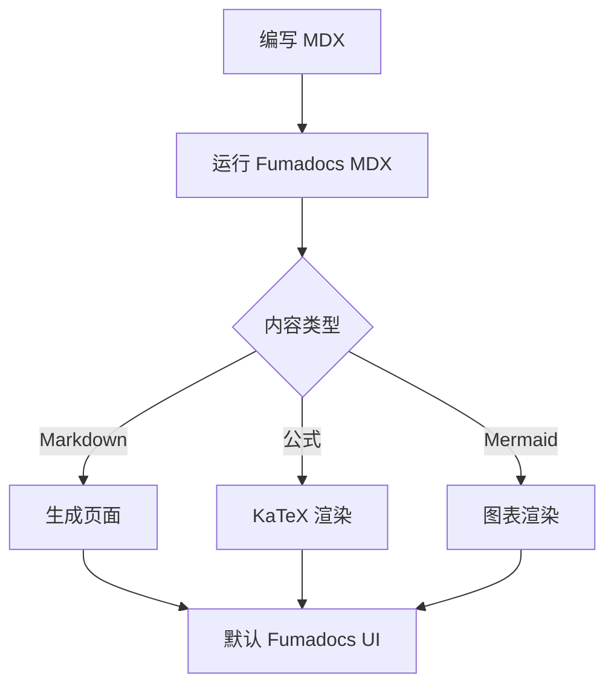
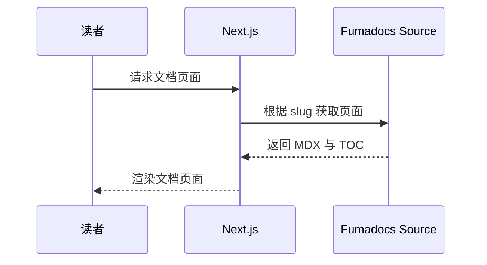

## 行内公式

二次方程 $ax^2+bx+c=0$ 的判别式是 $\Delta=b^2-4ac$。

## 块级公式

$$
\int_a^b f(x)\,\mathrm{d}x = F(b)-F(a)
$$

$$
\sum_{k=1}^{n} k = \frac{n(n+1)}{2}
$$

## 对齐公式

$$
\begin{aligned}
f(x+h)
&= f(x)+f'(x)h+\frac{f''(x)}{2!}h^2+\cdots \\
&= \sum_{k=0}^{\infty}\frac{f^{(k)}(x)}{k!}h^k
\end{aligned}
$$

## Mermaid 流程图

下面的 `mermaid` 代码块会被 `remarkMdxMermaid` 转换成全局注册的 Mermaid 组件。

## Mermaid 时序图

<Callout title="主题适配" type="info">
  Mermaid 组件会观察根元素的明暗主题 class，并在主题切换后重新渲染图表。
</Callout>
